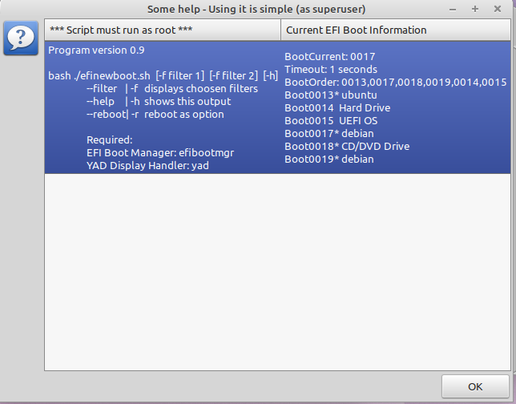
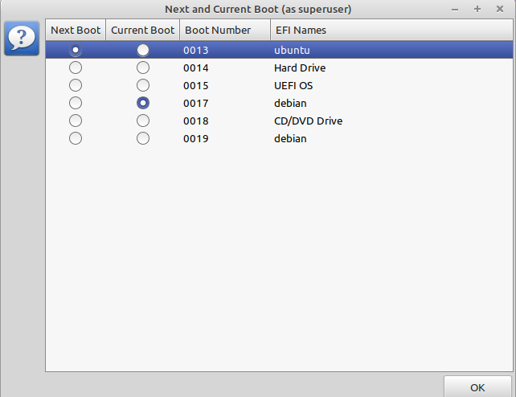
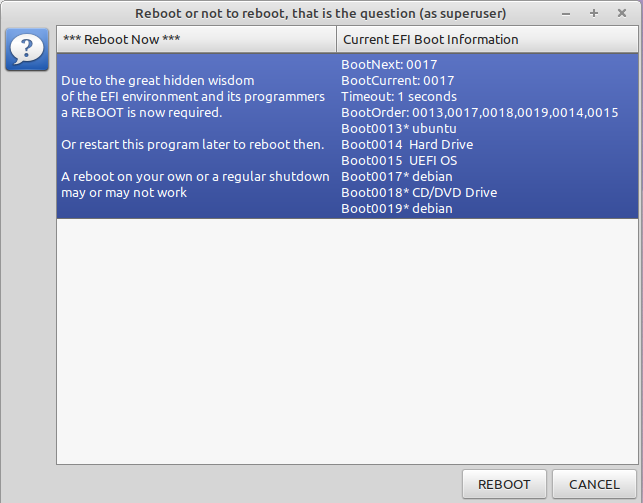

# EFI-New-Boot
 
## Description

With the *efibootmgr* program you are able to handle *UEFI* issues. This bash script allows to choose and to select your next OS from your desktop and to boot it immediately. If your Linux/Unix works without *UEFI* it is pretty useless.

I use *YAD* as the GUI inside bash. 

## Dependencies 

Required is the good old bash. It should run with most newer versions.

yad, as the display manager : `apt install yad`

efibootmgr, the Linux UEFI manager: `apt install efibootmgr`

Normally any version and combination of the software above will do the job.

## Required 

Superuser power as in root. No mere mortal is allowed to play around with efi power.
+ su -p for a root shell: _# bash  ./efinewboot.sh 
+ sudo bash ./efinewboot.sh 
 
## Get help 

bash ./efinewboot.sh -h  opens the following screen

 
+ efinewboot.sh -f ubuntu filters the output to ubuntu 
+ With efinewboot.sh -f ubuntu -f debian the display shows only the entries for ubuntu and debian. The number of filters is restricted to four [$1 - $9]
+ efinewboot.sh -r is a shortcut for a reboot  
## Start Display

You can only select the `Next Boot` buttons. 

## Final Display 

Reboot or Cancel everything. But fiddling with efibootmgr is tricky and a reboot is a safe bet.

## Changes

* v0.2 -> v0.3  date 26.Jul 2020
    1. change from tool zenity to yad 
    2. change from ksh to bash
    3. make single gui no more 2 gui's to handle
    4. add application icon
    